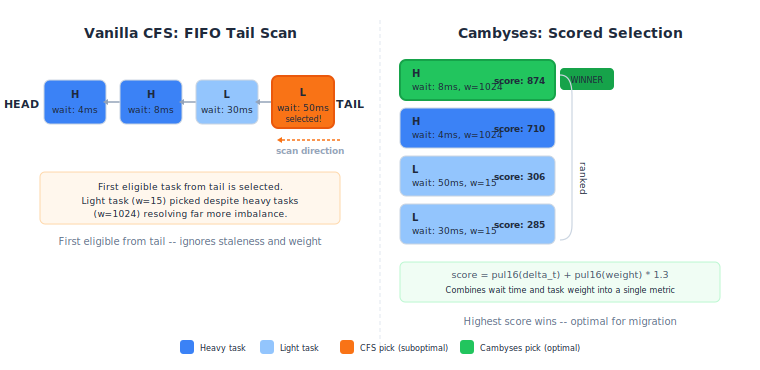
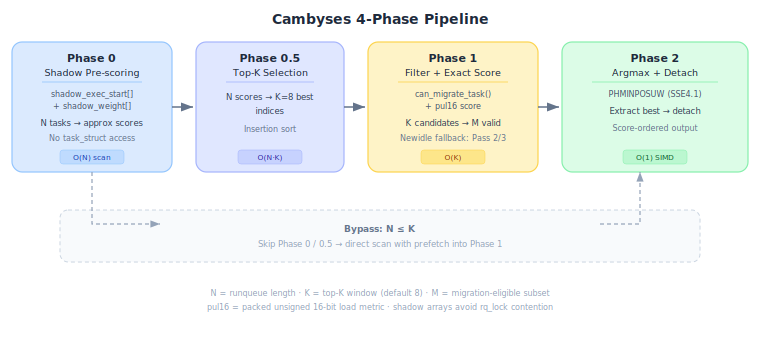
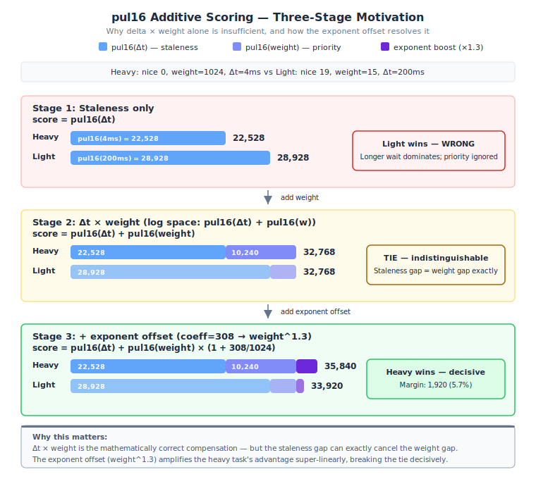
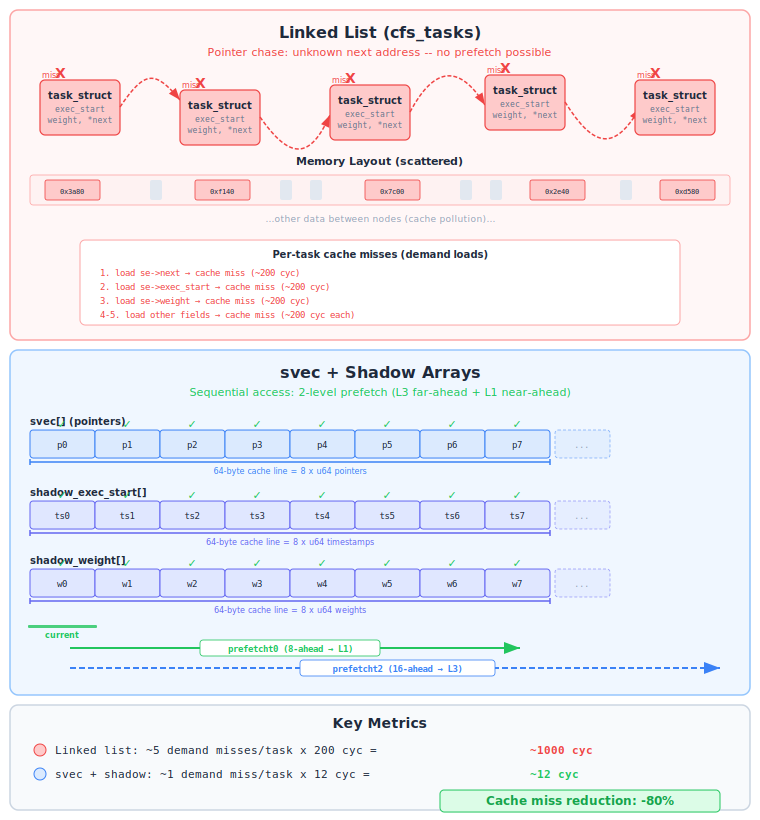
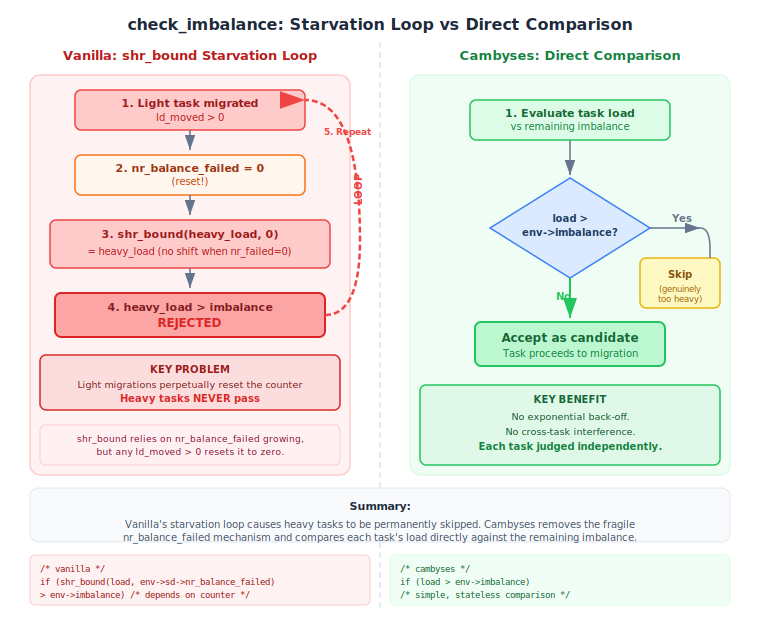
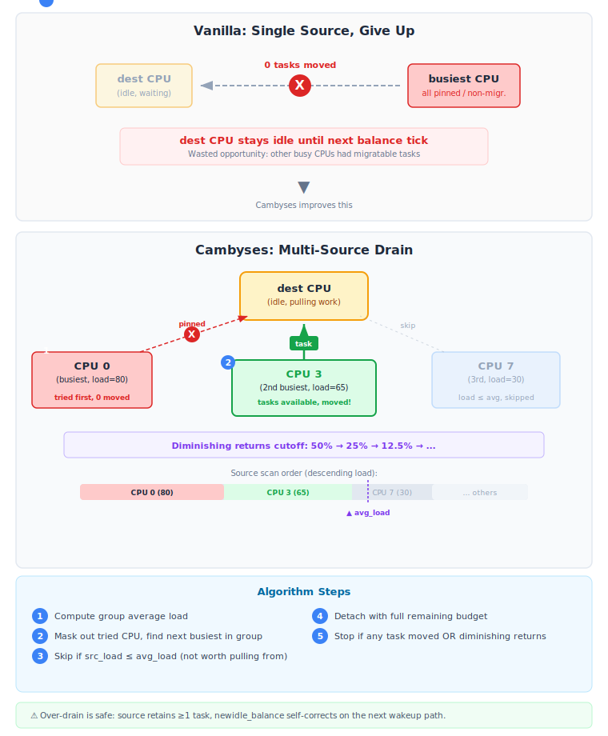
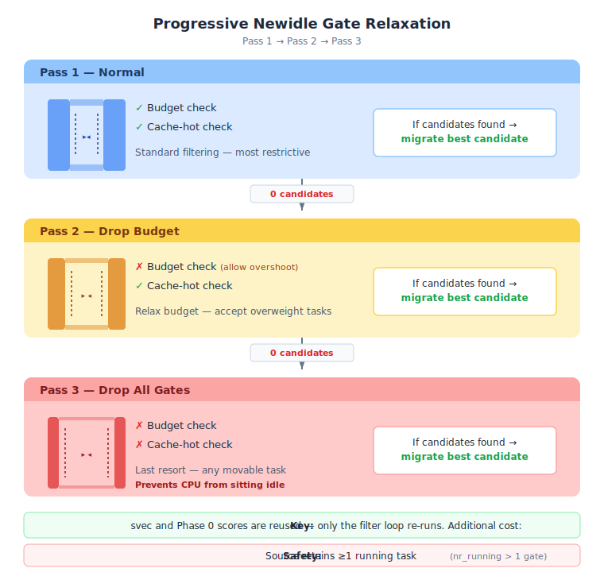
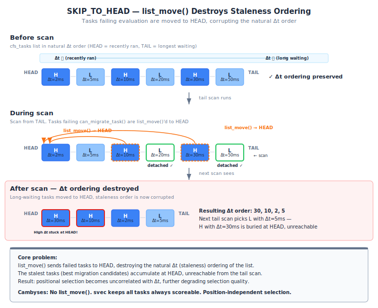

# Cambyses: Rebooted

**Context-Aware Migration Balancer Yielding Scored Entity Selection**

A Linux kernel patch that improves CFS load balancer migration efficiency through three complementary axes:

1. **Selection quality**: Replace the FIFO tail-scan with scoring-based selection (`pul16(staleness) + pul16(weight)^1.3`), choosing the globally optimal migration candidate from the entire runqueue rather than the first eligible task at the tail.
2. **Selection strategy**: Eliminate structural pathologies in Vanilla CFS — SKIP_TO_HEAD list pollution, `shr_bound` starvation loop — that prevent optimal task selection.
3. **Idle CPU utilization**: Multi-source balance drain (scan above-average CPUs when the busiest yields nothing) and progressive newidle fallback (relax budget and cache-hot gates) reduce the time CPUs sit idle waiting for the next tick.

## Problem

The CFS load balancer's `detach_tasks()` scans the `cfs_tasks` list from the tail and picks the first task that passes `can_migrate_task()`. The `task_hot()` check inside `can_migrate_task()` correctly filters out cache-hot tasks — they are never migrated. However, among the remaining cache-cold candidates, the selection criterion is purely **positional**: whichever cold task happens to be closest to the tail of the list is chosen, regardless of how suitable it actually is for migration.

This means the balancer relies solely on cache-coldness as a migration criterion. All cache-cold tasks are treated as equally good candidates, even though they differ significantly in:

- **Staleness**: A task idle for 50ms has a much colder cache than one idle for 2ms, yet both pass the binary hot/cold check.
- **Priority (weight)**: Migrating a heavy task (nice 0, weight 1024) resolves far more imbalance than migrating a light task (nice 19, weight 15), yet both are selected with equal probability.
- **Migration efficiency**: The ratio of imbalance resolved to migration cost varies widely across cold tasks, but vanilla makes no attempt to optimize it.

Furthermore, the tail position in `cfs_tasks` depends on insertion order and vruntime-driven requeuing, making the selection timing-dependent. The same workload can produce different migration decisions depending on when the balancer fires relative to wakeups and context switches — a stochastic outcome that may or may not align with the optimal choice.



## Approach

Cambyses replaces the single-pass FIFO scan with a 5-phase pipeline that pre-scores, filters, compresses, and rank-extracts migration candidates:

1. **Phase 0 — Shadow Pre-scoring**: Compute approximate scores from shadow arrays (`shadow_exec_start[]`, `shadow_weight[]`) stored in `struct rq`. No `task_struct` access — pure sequential array reads. Scans up to 64 tasks.
2. **Phase 0.5 — Top-K Selection**: Select the top-K (K = `SCHED_NR_MIGRATE_BREAK`, typically 8) highest-scoring indices via insertion sort into a fixed-size buffer.
3. **Phase 1 — Filter + Exact Score**: Evaluate only the top-K candidates with `can_migrate_task()` and `check_imbalance_cambyses()`, computing exact pul16 scores directly as u16 via the additive formula. Newidle fallback (Pass 2/3) retries with relaxed gates if no candidates pass.
4. **Phase 2 — Argmax Extraction + Detach**: Repeatedly extract the highest-scoring candidate via SIMD PHMINPOSUW or scalar 4-way reduction, detaching in score order while consuming the imbalance budget.

For small runqueues (N ≤ K), Phase 0/0.5 are bypassed and all tasks are evaluated directly with two-level prefetch.

Both the pull path (`detach_tasks()`) and push path (`detach_one_task()`) are supported. The push path uses a simple max search since only one task is migrated.

All Cambyses paths run under the existing `rq_lock_irqsave` — no additional locking is required.



## Scoring

### Score Formula

```
score(p) = pul16(now − exec_start(p)) + pul16(weight(p)) × (1 + coeff / 1024)
```

An additive score in pul16 (log2-approximate u16) space, combining two factors:

- **`pul16(now − exec_start)`** (staleness): Time since the task last received CPU time, compressed to 16-bit log scale. Longer-waiting tasks have colder caches and are cheaper to migrate.
- **`pul16(weight)`** (CFS priority): The task's load weight compressed to 16-bit log scale. The tunable coefficient (`sysctl kernel.sched_cambyses_weight_coeff`, 0-1024, default 308) amplifies weight's contribution.

With `coeff = 308` (≈ log10(2) × 1024), the effective score in linear space is proportional to `delta × weight^1.3` — heavier tasks receive a moderate priority boost without starving long-waiting light tasks.

The additive pul16 formulation eliminates Phase 1.5 (u64 → pul16 batch conversion) since scores are computed directly as u16, and gives both factors comparable dynamic range regardless of their absolute magnitudes.



### Mathematical Justification

#### Why staleness + weight in log space?

The migration cost C(p) of a task p is primarily determined by its cache footprint. A task that has not run for time Δt will have a cache residency that decays approximately as:

```
cache_residency(Δt) ∝ e^(−Δt / τ)
```

where τ is a cache decay time constant (typically 1-10ms, determined by cache size and system activity). The migration cost is proportional to the cache lines that must be reloaded:

```
C(p) ∝ footprint(p) × cache_residency(Δt)
```

For large Δt (Δt >> τ), cache_residency → 0, making migration nearly free. The linear approximation `Δt` used in the score is a monotonic proxy for `−cache_residency(Δt)`: maximizing Δt minimizes cache migration cost.

#### Why not just staleness?

CFS exhibits a **statistical priority inversion** in migration selection. Consider two tasks on a busy runqueue:

| Task | Weight | Typical Δt | pul16(Δt) | pul16(w) | Score (coeff=308) |
|------|--------|-----------|-----------|----------|-------------------|
| Heavy (nice 0) | 1024 | 4ms | ~22,528 | ~10,240 | ~35,859 |
| Light (nice 19) | 15 | 50ms | ~25,600 | ~3,840 | ~30,598 |

Without weight contribution, the light task's larger Δt would make it the preferred migration candidate. The additive pul16 formulation with `coeff=308` gives the heavy task a higher score despite shorter wait time, because its weight^1.3 boost overcomes the staleness gap.

The key advantage of log-space addition over linear multiplication is **dynamic range normalization**: when Δt varies by 10^6× and weight varies by 68× (nice −20 to nice 19), multiplication makes Δt dominate. In pul16 space, both are compressed to ~16-bit range, giving weight a meaningful voice in the selection.

#### Why weight^1.3?

The coefficient 308 (≈ log10(2) × 1024) produces effective weight exponent 1.3. The break-even point for a light task competing against a heavy task is:

```
light needs delta_ratio ≈ (weight_heavy / weight_light)^1.3 × longer wait
```

For nice 0 vs nice 19: weight ratio 68×, light needs ~210× longer wait. For nice −3 vs nice 5: weight ratio 4.7×, light needs ~7.5× longer wait. This provides a meaningful heavy-task preference while preserving starvation avoidance for long-waiting light tasks.

#### Monotonicity of pul16 compression

The u64 score is compressed to u16 pul16 (Packed Unsigned Log, 16-bit) for SIMD-friendly argmax. pul16 is defined as:

```
pul16(v) = (62 − clz(v)) << 10 | mantissa_top_10_bits(v)
```

where `clz` is count-leading-zeros and mantissa is the 10 bits below the leading 1-bit.

**Theorem**: For all u64 values a, b ≥ 2: a > b ⟹ pul16(a) > pul16(b).

*Proof*: If a > b, then either (i) clz(a) < clz(b), giving a strictly larger exponent field, or (ii) clz(a) = clz(b), in which case the leading 1-bit positions are equal and the 10-bit mantissa of a is strictly greater. In both cases the 16-bit concatenation preserves the ordering. ∎

This means `argmax(pul16(scores)) = argmax(scores)` — the compression is lossless for ranking.

## Key Techniques

### Swap Vector (svec)

`svec` is a new generic kernel data structure (`include/linux/svec.h`), inspired by [Jean Tampon](https://github.com/johnBuffer)'s [StableIndexVector](https://github.com/johnBuffer/StableIndexVector), that supplements the `cfs_tasks` linked list with a fixed-capacity contiguous pointer array (max 256 entries). The linked list remains the authoritative data structure; svec provides a prefetch-friendly view for Cambyses's scoring pipeline.

| Operation | Linked list (`cfs_tasks`) | svec |
|-----------|--------------------------|------|
| Insert | O(1) `list_add` | O(1) append |
| Delete | O(1) `list_del` | O(1) swap-and-pop |
| Iterate | Pointer chase per element | Sequential array access |
| Prefetch | Impossible (unknown next) | Multi-stage depth (index+N) |
| Random access | O(N) walk | O(1) by index |

The intrusive design mirrors `list_head`: each element embeds a `struct svec_node` (4 bytes: `int svec_idx`), and the `svec_head` holds a caller-provided pointer array. Deletion uses swap-and-pop — the last element is moved into the deleted slot — maintaining contiguity without shifting. Order is not preserved, which is acceptable because Cambyses scores all candidates regardless of position.



### Shadow Arrays

Two arrays parallel to the svec, stored in `struct rq`:

```c
u64           cambyses_shadow_exec_start[256];
unsigned long cambyses_shadow_weight[256];
```

These are synchronized at four points:

| Event | Fields updated | Location |
|-------|---------------|----------|
| Enqueue | `exec_start`, `weight` | `account_entity_enqueue()` |
| Dequeue | Swap-and-pop mirror | `account_entity_dequeue()` |
| Tick | `exec_start` → `now` | `update_curr()` |
| Reweight | `weight` | `reweight_entity()` |

Phase 0 reads only these arrays — 8 entries per cache line for `u64`, purely sequential access. For N=32 tasks, this requires ~8 cache lines (likely L2-resident since they are in `struct rq`), compared to ~160 cache lines if reading `task_struct` fields directly (5 lines × 32 tasks).

### pul16 (Packed Unsigned Log, 16-bit)

Monotonic compression of u64 → u16 for SIMD-friendly score representation, based on the integer floating-point concept from my own [intfp](https://github.com/firelzrd/intfp) (the kernel implementation uses FPU-based conversion rather than the pure-integer approach):

```
Format: | 6-bit exponent | 10-bit mantissa |
Range:  0 .. 2^62 (covers all practical delta × weight values)
Cost:   CLZ + 2 shifts + 1 add ≈ 4-5 cycles/value (scalar)
```

Scalar pul16 conversion uses CLZ + 2 shifts + 1 add (4-5 cycles/value). Scores are now computed directly as pul16 during Phase 1, eliminating the need for batch conversion. The SIMD batch conversion path (IEEE 754 double trick) is retained for potential future use but is no longer on the critical path.

### SIMD Argmax

Phase 2 uses `PHMINPOSUW` (SSE4.1) — a single instruction that returns both the minimum value and its lane index from 8 × u16. By XOR-ing scores with 0xFFFF, max→min conversion enables using PHMINPOSUW for argmax. Tombstoned entries (score = 0) become 0xFFFF after XOR, ensuring they are never selected.

| ISA | Registers | Algorithm | Cycles (est.) |
|-----|-----------|-----------|---------------|
| AVX2 / SSE4.1 | 1-4 xmm | XOR → PHMINPOSUW → scalar merge | ~7-15 |
| SSSE3 (no SSE4.1) | 4 xmm | Scalar hmax → PCMPEQW → PMOVMSKB → BSF | ~20-30 |
| Scalar (4-way) | GPR only | 4-way parallel reduction → 3-CMP tree merge | ~14-43 |

### Two-Level Prefetch Pipeline

svec's contiguous layout enables multi-stage software prefetch — impossible with linked lists where the next element's address is unknown until the current node is loaded.

```
Level 2 (16-ahead): DRAM → L3   via prefetchT2   (1 line: exec_start)
Level 1 (8-ahead):  L3 → L1    via prefetchT0    (4 lines: exec_start, util_avg, cpus_ptr, on_cpu)
```

By the time Level 1 fires, data is already in L3 (~10-15 cycle hit) instead of DRAM (~200+ cycle miss). Each task access requires ~5 cache lines; 4 are covered by prefetch, leaving only ~1 demand miss per task (L2 hit, ~12 cycles).

**MSHR budget**: The sliding prefetch window issues 4-5 lines per iteration, well within L1D's 12-16 MSHRs (Miss Status Holding Registers) on modern x86. The priming burst (first 16 tasks) issues more concurrent prefetches but MSHRs gracefully drop excess requests without stalling.

### FPU Context Management

SIMD paths (argmax) require FPU/FPSIMD context. `kernel_fpu_begin()` is unsafe in softirq context (`irq_fpu_usable()` returns false when `softirq_count() != 0`):

- **`newidle_balance`** (process context): `irq_fpu_usable()` returns true → SIMD path available. FPU save cost is near-zero because `TIF_NEED_FPU_LOAD` is typically already set after a context switch.
- **`SCHED_SOFTIRQ`** (`run_rebalance_domains`): Falls back to scalar 4-way argmax. The scalar path is only ~20 cycles slower than SIMD at typical candidate counts.

### Static Key Zero-Cost Disable

`DEFINE_STATIC_KEY_TRUE(sched_cambyses)` enables Cambyses from boot. The `detach_tasks()` and `detach_one_task()` dispatch points use `static_branch_likely()`:

```c
if (static_branch_likely(&sched_cambyses))
    return detach_tasks_cambyses(env);
// else: fall through to vanilla FIFO path
```

When disabled via `sysctl kernel.sched_cambyses=0`, the branch is NOP-patched — zero overhead on the vanilla path. The svec is always maintained regardless of the static key state (to avoid stale-pointer bugs on re-enable), but the svec maintenance cost is negligible (one pointer write + index update at enqueue/dequeue).

## Configuration

### Build

| Option | Description |
|--------|-------------|
| `CONFIG_SCHED_CAMBYSES` | Core Cambyses functionality. Depends on `SMP`. Default `y`. |
| `CONFIG_SCHED_CAMBYSES_SIMD` | SIMD argmax + pul16 conversion. Depends on `X86_64` or `ARM64 && KERNEL_MODE_NEON`. Default `y`. |

### Runtime (sysctl)

| Parameter | Default | Range | Description |
|-----------|---------|-------|-------------|
| `kernel.sched_cambyses` | `1` | 0-1 | Enable/disable via static key. When `0`, all Cambyses paths are NOP-patched out. |
| `kernel.sched_cambyses_debug` | `0` | 0-1 | Enable trace_printk debug output for both Vanilla and Cambyses balance paths. |
| `kernel.sched_cambyses_newidle_fallback` | `2` | 0-2 | Newidle gate relaxation level. 0: no fallback (normal pass only). 1: drop budget check (allow overshoot, respect cache-hot). 2: drop budget + cache-hot (any movable task). |
| `kernel.sched_cambyses_weight_coeff` | `308` | 0-1024 | Weight amplification coefficient for scoring. Effective weight exponent = 1 + coeff/1024. Default 308 ≈ log10(2) × 1024 → weight^1.3. |

## Load Balance Improvements

### check_imbalance_cambyses: shr_bound Elimination

Vanilla's `detach_tasks()` uses `shr_bound(load, nr_balance_failed) > imbalance` to filter migration candidates. `shr_bound(load, n)` computes `load >> n`, progressively relaxing the check as `nr_balance_failed` grows. However, `nr_balance_failed` is reset to 0 whenever *any* task is successfully migrated. This creates a starvation loop:

1. Light task migrated → `ld_moved > 0` → `nr_balance_failed = 0`
2. Heavy task checked: `shr_bound(heavy_load, 0) = heavy_load > imbalance` → rejected
3. Repeat: light migrations perpetually reset the counter, heavy tasks never pass

Cambyses replaces this with a direct `load > env->imbalance` comparison. A task is excluded only when its load genuinely exceeds the remaining budget — no exponential back-off, no cross-task interference.



### Multi-Source Balance Drain

When `detach_tasks()` returns 0 from the busiest CPU, Vanilla gives up and waits for the next tick. Cambyses continues by scanning additional above-average CPUs in the same group:

1. Compute group average load (one-time, lock-free)
2. Mask out the tried CPU, call `sched_balance_find_src_rq()` for the next busiest
3. Skip if `src_load <= avg_load` (would create reverse imbalance)
4. Detach from the new source with the full remaining `env.imbalance` as budget (no per-source cap — over-drain is acceptable because `newidle_balance` self-corrects if the source subsequently goes idle)
5. Stop if any task is successfully moved
6. Diminishing-returns cutoff: stop if cumulative moved load ≥ `init_imbalance >> drain_nr` (50% → 25% → 12.5%...)

This is safe because Cambyses's scan has no side effects on the source rq (no `list_move` reordering), and an empty result returns immediately via `nr_cands == 0`.



#### Over-Drain Safety

The drain does not cap per-source extraction to `src_load - avg_load`. A source may be drained below average, but this is benign: the source retains at least 1 running task (`nr_running > 1` gate), and if it becomes idle, its own `newidle_balance` will pull work back. The cost of one extra newidle re-entry is far less than leaving the destination CPU idle.

### Newidle Fallback

When a CPU becomes idle and `newidle_balance` fires, the imbalance budget is often small. The normal filter (`check_imbalance_cambyses` + `sched_task_hot`) may reject all candidates, leaving the CPU idle until the next tick.

Cambyses adds progressive gate relaxation (controlled by `sysctl kernel.sched_cambyses_newidle_fallback`):

| Pass | Budget check | Cache-hot check | When |
|------|-------------|-----------------|------|
| 1 (normal) | Yes | Yes | Always |
| 2 | **No** (allow overshoot) | Yes | fallback ≥ 1 and Pass 1 found 0 candidates |
| 3 | **No** | **No** (allow hot) | fallback ≥ 2 and Pass 2 found 0 candidates |

The svec and raw scores from Phase 0 are reused — only the filter loop is re-run, so additional cost is minimal. Over-drain is acceptable because the source retains at least 1 running task (`nr_running > 1` gate), and if the source subsequently goes idle, `newidle_balance` self-corrects.



### Additive pul16 Scoring with Weight Amplification

The scoring formula `pul16(delta) + pul16(weight) × (1 + coeff/1024)` works in concert with the load balance improvements:

- **shr_bound elimination** ensures heavy tasks are not excluded by a broken exponential back-off
- **Newidle fallback** ensures heavy tasks enter the candidate pool even when the budget is small
- **Weight amplification** (`coeff=308`, weight^1.3) ensures heavy tasks rank higher among candidates

Without the scoring change, the first two improvements would admit heavy tasks as candidates but not preferentially select them — the old `delta × weight` formula is dominated by delta's dynamic range, making weight differences invisible. The pul16 additive formula compresses both factors to comparable ranges, giving weight a meaningful voice in selection.

## Empirical Findings: Migration Efficiency

Trace-based A/B benchmarks (16-core Zen 4, 56 tasks: 40 workers on CPU 0 with 8 heavy nice −3 and 32 light nice 5, 8 fillers per CPU, BORE disabled, 30s × 3 runs) reveal structural inefficiencies in Vanilla CFS that Cambyses eliminates.

### Scan Efficiency

| Metric | Vanilla | Cambyses |
|--------|---------|----------|
| Balance scans | 1,774 | 2,207 |
| Total detach | 2,937 | 3,352 |
| Total scan iterations | 13,478 | 3,352 |
| **Scan efficiency** | **21.8%** | **100%** |
| SKIP_TO_HEAD events | 10,541 | 0 |
| Balance failures | 10,048 | 8,777 |

Vanilla evaluates 13,478 task iterations across 1,774 balance scans but only successfully detaches 2,937 tasks — **78.2% of all scan iterations are wasted**. Each wasted iteration involves a `can_migrate_task()` call and a `list_move()` to HEAD, consuming cycles under `rq_lock`.

Cambyses pre-filters candidates via svec + `can_migrate_task()` before scoring. The `next:` label's `list_move()` — which reorders the `cfs_tasks` list — does not exist in the Cambyses path. Every scan iteration results in a successful detach.

### Heavy Task Selection

| Metric | Vanilla | Cambyses |
|--------|---------|----------|
| Heavy first rate | 6.7% | **22.1%** |
| Heavy detached | 216 | **335** |
| Heavy detach ratio | 8.2% | **10.0%** |
| Total detached | 2,638 | 3,352 |

Cambyses selects heavy tasks 3.3× more frequently as the first migration choice. The pul16 additive scoring with weight^1.3 boost, combined with newidle fallback that relaxes the budget filter, enables heavy tasks to be scored and selected even when the imbalance budget is small.

### The `SKIP_TO_HEAD` Cascade

Vanilla's `detach_tasks()` contains a `next:` label that moves each non-migratable task to the HEAD of the `cfs_tasks` list via `list_move()`. This creates a cascading reordering effect:

1. **Balance scan**: Tail-scan evaluates tasks from TAIL. Tasks failing `can_migrate_task()` are moved to HEAD.
2. **List pollution**: The reordering is persistent — it affects all subsequent scans on the same runqueue, not just the current one.
3. **Heavy tasks stuck at HEAD**: Heavy tasks frequently fail migration due to `sched_delayed` state or `shr_bound(load) > imbalance` (their individual load exceeds the imbalance budget). Each failed migration moves them to HEAD, making them progressively harder to reach from the tail.
4. **Light-only migration**: Over successive balance events, only light tasks remain near the TAIL and are detached. Heavy tasks accumulate at HEAD, effectively unreachable.

Trace evidence from src_cpu=0 (Vanilla run):
```
Scan 1 (nr=8): L,L,L detached → H,H,L,L,L moved to HEAD
Scan 2 (nr=5): L detached → H,H,L,L moved to HEAD
Scan 3 (nr=4): L detached → H,H,L moved to HEAD
Scan 4 (nr=3): All SKIP → 0 detached (complete stall)
Scan 5 (nr=3): L detached (imbal overshoot to −2)
Scan 6 (nr=2): H,H only → both can_mig=0 → permanent stall
```

Result: heavy tasks accumulate at HEAD and are effectively unreachable from the tail scan.



### Wasted Source Selection

Vanilla's `find_busiest_queue()` selects the source CPU by load magnitude. A CPU with 2 heavy tasks shows high aggregate load but may have **zero migratable tasks** (both `sched_delayed` or `can_mig=0`). The balance scan runs to completion, evaluates every task, and detaches nothing.

Cambyses also uses the same `find_busiest_queue()` for source selection, but its pre-scoring + filtering pipeline returns early when no candidates pass `can_migrate_task()`:
- **Vanilla empty scan**: O(N) iterations with `can_migrate_task()` + `list_move()` per task
- **Cambyses empty scan**: O(N) shadow reads + O(K) `can_migrate_task()` on top-K → `nr_cands == 0` → immediate `return 0`

### Light Task Redistribution Churn

Because Vanilla exclusively detaches light tasks, destination CPUs accumulate light tasks and become overloaded themselves. This triggers secondary balance events where the destination becomes the new source — creating a **light task redistribution chain**:

```
CPU 0 → CPU 8: detach L,L,L    (CPU 8 now overloaded)
CPU 8 → CPU 7: detach L,L      (CPU 7 now overloaded)
CPU 8 → CPU 1: detach L,L,L,L  (CPU 1 now overloaded)
CPU 8 → CPU 7: still SKIP all  (heavy stuck, light gone)
```

Cambyses selects tasks by score (`pul16(delta) + adjusted_pul16(weight)`), mixing heavy and light tasks proportionally to their urgency. This produces more weight-balanced migrations, reducing the cascading rebalance phenomenon.

## Performance

### Cost Model

All estimates assume 4 GHz (Zen 4 / Alder Lake), L1=4 cyc, L2=12 cyc, L3=40 cyc, DRAM=200 cyc, `SCHED_NR_MIGRATE_BREAK=8` (CachyOS).

#### Per-Task Cache Access Cost

| Component | Cache lines | Vanilla (linked list) | Cambyses (svec + 4-line prefetch) |
|-----------|-------------|----------------------|--------------------------------------|
| `can_migrate_task` | 3 (cpus_ptr, on_cpu/flags, sched_task_hot) | 3 × demand miss | 2 prefetched + 1 demand miss |
| Score computation | 2 (exec_start, util_avg) | N/A | 2 prefetched |
| List/svec traversal | 1 (next pointer / svec index) | Pointer chase | Sequential array |
| **Total** | **~5** | **~5 demand misses** | **~1 demand miss** |

#### Phase-by-Phase Breakdown

**Small path (N ≤ 8, direct scan, migrate 1 task):**

| Phase | Work | Cycles |
|-------|------|--------|
| Phase 1 | 8 tasks × (can_migrate_task + pul16 score), 4-line prefetch | 8 × 50 ≈ **400** |
| Phase 2 | argmax × 1 + detach | **80** |
| **Total** | | **~480 cyc ≈ 120 ns** |

**Pre-score path (N > 8, e.g. N=20, migrate 1 task):**

| Phase | Work | Cycles |
|-------|------|--------|
| Phase 0 | 20 shadow entries: sequential read + multiply | 20 × 4 + ~72 (L2 loads) ≈ **152** |
| Phase 0.5 | Top-8 selection: insertion sort | 20 × 5 ≈ **100** |
| Phase 1 | 8 top-K tasks × (can_migrate_task + pul16 score), prefetch | 8 × 50 ≈ **400** |
| Phase 2 | argmax × 1 + detach | **80** |
| **Total** | | **~730 cyc ≈ 183 ns** |

### Vanilla vs Cambyses

#### Typical case (N=20 tasks on src_rq, migrate 1 task, L3-resident)

| | Vanilla | Cambyses |
|--|---------|-------------|
| Tasks evaluated | First ~3 (FIFO, stop at first eligible) | Top-8 from all 20 (scored) |
| Selection quality | Stochastic (timing-dependent) | Deterministic (highest score) |
| Candidate search range | First eligible only | Full runqueue via shadow |
| Per-task cache cost | ~5 demand misses × ~40 cyc = ~200 cyc | ~1 demand miss × ~12 cyc = ~47 cyc |
| Total latency | ~540 cyc / ~135 ns | ~730 cyc / ~183 ns |

#### Worst case (N=64 tasks, migrate 8 tasks, DRAM-cold)

| | Vanilla | Cambyses |
|--|---------|-------------|
| Tasks evaluated | 8 (loop_break, FIFO) | Top-8 from all 64 (scored) |
| Selection quality | Arbitrary first-8 | Best-8 globally |
| Total latency | ~6,400 cyc / ~1,600 ns | ~3,100 cyc / ~776 ns |

#### Summary comparison

| Metric | Vanilla | Cambyses | Change |
|--------|---------|-------------|--------|
| Selection method | FIFO (first eligible) | Scored (pul16 additive, weight^1.3) | Quality ↑ |
| Data structure | Linked list | svec (contiguous array) | Prefetch enabled |
| Demand misses/task | ~5 | ~1 | **−80%** |
| Search range (N=64) | 8 tasks | 64 tasks | **8× wider** |
| Small rq (N≤8) | ~540 cyc / 135 ns | ~480 cyc / 120 ns | **−11%** |
| Large rq worst case | ~6,400 cyc / 1,600 ns | ~3,100 cyc / 776 ns | **−52%** |

### Why the Overhead Pays for Itself

For medium-sized runqueues (N=9-32), Cambyses adds ~200 cycles of pre-scoring overhead versus Vanilla's early-exit. This cost is recovered by:

1. **Better budget utilization per migration.** By preferring stale, heavy tasks, each migration resolves more imbalance. Fewer total migrations means fewer IPI round-trips, fewer rq lock acquisitions, and fewer cache invalidations.

2. **Suppression of re-migration (ping-pong).** Vanilla's positional FIFO selection may pick a marginally cold task that still has significant cache affinity to its current CPU, causing the balancer to move it back on the next run. Cambyses preferentially selects the *most* stale tasks (highest Δt), which have minimal remaining cache affinity and are less likely to be pulled back. A single avoided re-migration saves ~2,000-10,000 ns (two full migration costs).

3. **Dual-sided responsiveness improvement.** Preferring heavy tasks benefits both sides of the migration:
   - **Source rq**: Removing the largest CPU consumer maximally reduces contention for the remaining tasks. Moving a weight-1024 task frees ~49.6% of CPU time on a 3-task rq, versus ~0.7% for a weight-15 task.
   - **Destination rq**: The migrated heavy task — which was CPU-starved due to competition on the busy rq — immediately receives 100% of the idle CPU. The benefit of exclusive CPU access is proportional to the task's weight: a heavy task gains far more throughput from being moved to an idle CPU than a light task that was already consuming only a small fraction of CPU time.

4. **Reduced scheduler overhead (positive feedback loop).** Fewer migrations and fewer re-migrations mean the balancer converges faster. On high-core-count systems where the balancer runs O(N_cpus) times per tick, even modest reduction in per-run migration count cascades into lower total scheduler CPU time.

### Stack Usage

Worst-case stack for `detach_tasks_cambyses()`:

| Variable | Size |
|----------|------|
| `cands[8]` (pointers) | 64 bytes |
| `scores[8..32]` (u16) | 16-64 bytes |
| `pre_scores[64]` (u64, pre-score path only) | 512 bytes |
| `topk_indices[8]` (int) | 32 bytes |
| `topk_scores[8]` (u64) | 64 bytes |
| `selected[8]` (int, SIMD path only) | 32 bytes |
| **Total (worst case)** | **~832 bytes** |

Well within the typical 16KB kernel stack (THREAD_SIZE).

## File Layout

```
include/linux/
└── svec.h                        # Swap Vector generic data structure

kernel/sched/
├── fair.c                        # Static key dispatch + shadow sync hooks
├── cambyses.c                    # Scoring, phases 0-2, sysctl, init
├── cambyses.h                    # Struct definitions, SIMD declarations
├── cambyses_simd_avx2.c          # AVX2: PHMINPOSUW argmax + IEEE 754 pul16
├── cambyses_simd_ssse3.c         # SSSE3/SSE4.1: argmax + SSE2 pul16
├── cambyses_simd_neon.c          # NEON: argmax + pul16 (ARM64)
├── sched.h                       # struct rq: svec + shadow arrays
└── Makefile                      # SIMD TUs with ISA-specific CFLAGS
```

`cambyses.c` is `#include`d from `fair.c` (not compiled separately) to access static functions: `can_migrate_task()`, `detach_task()`, `task_h_load()`, etc.

## Version History

The project was discontinued at v0.3.0 — the multi-signal configurable scoring architecture proved over-engineered, and benchmark results did not demonstrate clear improvement over Vanilla CFS. The project was later restarted after discovering that a simple two-factor additive formula (`pul16(staleness) + pul16(weight)`) combined with svec-based contiguous iteration and shadow array pre-scoring could achieve both better selection quality and lower overhead than the original design.

| Version | Architecture | Scoring | Data Structure |
|---------|-------------|---------|----------------|
| v0.3.0 | 2-phase: scan + argmax | 4-feature weighted linear combination (8 signals) | Linked list (`cfs_tasks`) |
| *(discontinued)* | | | |
| v0.4.0 | 5-phase: shadow pre-score → top-K → filter → pul16 → argmax | Single-feature: `staleness × weight` (multiplicative u64) | svec + shadow arrays |
| v0.5.0 | 4-phase: shadow pre-score → top-K → filter+score → argmax | Additive pul16: `pul16(Δt) + pul16(w) × 1.3` | svec + shadow arrays |

Key changes from v0.4:
- Replaced multiplicative `delta × weight` (u64) with additive `pul16(delta) + adjusted_pul16(weight)` (u16)
- Eliminated Phase 1.5 (u64 → pul16 batch conversion) — scores computed directly as u16
- Replaced `shr_bound(load, nr_balance_failed)` with direct `load > imbalance` comparison
- Added multi-source balance drain (scan above-average CPUs when busiest yields nothing)
- Added newidle fallback (progressive gate relaxation: budget → cache-hot → none)
- Added `sched_cambyses_weight_coeff` sysctl for tunable weight amplification
- Added `sched_cambyses_newidle_fallback` sysctl for fallback level control
- Added `sched_cambyses_debug` sysctl with trace_printk for both Vanilla and Cambyses paths

Key changes from v0.3:
- Replaced linked list traversal with svec for prefetch-friendly contiguous access
- Simplified 4-slot × 8-signal configurable scoring to a single principled metric
- Added shadow arrays for task_struct-free pre-scoring (Phase 0)
- Added top-K selection to evaluate best candidates from the entire runqueue (Phase 0.5)
- Replaced s16 signed scores with u16 pul16 (log-compressed, unsigned, SIMD-native)
- Added IEEE 754 double trick for SIMD batch u64→pul16 conversion (Phase 1.5)
- Added two-level prefetch pipeline (L1 8-ahead + L3 16-ahead)
- Removed all runtime-configurable signal routing (static key binary tree, cached signals)

## License

GPL-2.0
